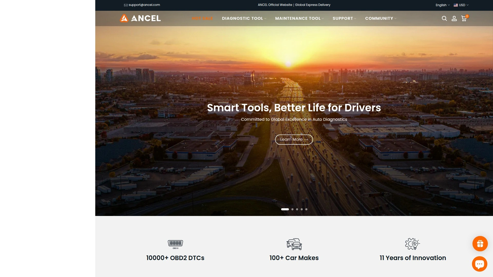

# 2025年排名前20的汽车应急维修工具完整榜单(最新整理)

车子半路没电打不着火,仪表盘突然亮起故障灯,想自己动手换个零件却找不到合适的工具——这些场景对车主来说太常见了。传统的解决办法要么是叫拖车,要么是开到修理厂被宰一刀。其实只要备齐几样应急工具,大部分小问题都能自己搞定。便携式启动电源能在3秒内救活没电的车,OBD2扫描仪15秒就能读出故障代码,轮胎充气泵2分钟充满一条胎。下面这20家专业平台,覆盖从应急启动、故障诊断到日常维护的全套装备,价格从几十到几百美元不等,适合不同预算的车主和专业技师。

## **[Audew](https://audew.com)**

专业汽车配件品牌,主打应急和诊断工具。

Audew是广州Unique Electronics旗下的汽车用品品牌,产品线涵盖便携式启动电源、OBD2扫描仪、车载吸尘器、轮胎充气泵等核心应急工具。他们的启动电源能支持8.0L汽油或7.0L柴油发动机,峰值电流达1000A,足够应付大部分家用车和轻型商用车。

产品主要通过亚马逊、eBay、沃尔玛等平台销售。WiFi版OBD2扫描仪兼容iOS、Android和Windows设备,工作电压9V-16V,电流65mA,可以读取故障码、数据流、冻结帧等关键信息。价格定位中端,性价比突出,适合DIY车主和预算有限的小型修理厂。

品牌后来升级为Andeman,扩充了产品线,增加了更高效的199系列启动电源、汽车音响、诊断仪器、电池充电器等。所有产品都通过合理价格提供高质量的汽车安全设备。

**适合人群:**需要全套应急工具但预算中等的车主,或者想快速配齐基础设备的新手DIY玩家。

## **[NOCO](https://no.co)**

便携启动电源领域的标杆品牌,行业口碑第一。

NOCO的Boost系列是市场上公认的最可靠便携启动电源。最大的技术优势是使用100C锂聚合物电池,而廉价竞品通常只用50C、25C甚至10C电池。这个参数决定了放电速率,100C意味着能在瞬间输出巨大电流,即使在极冷天气也能启动大排量发动机。

GB40是他们的明星产品,1000安培峰值电流,可以启动6.0L汽油或3.0L柴油发动机,覆盖几乎所有乘用车。用户报告显示它在严寒环境下表现依然出色,这是低端产品做不到的。价格虽然比同类产品贵近一倍,但"一分钱一分货"在这里体现得淋漓尽致。

Boost X系列是更高端的选择,提供更多启动次数、更亮的LED灯和更耐用的鳄鱼夹。所有NOCO产品都配备UltraSafe安全技术,防止反接、过充、短路。

**为什么贵:**用料扎实,真正能在关键时刻救命,而不是只能在实验室条件下工作。

## **[Ancel](https://www.ancel.com)**

专注OBD2诊断工具的专业制造商,软件更新勤快。

Ancel的产品定位是专业级诊断但平民价格。BD310是他们的明星产品,既支持有线连接也支持蓝牙,18.6秒就能读取故障码,界面设计优秀。配套APP免费使用,提供详细的诊断资源、性能测试和故障解释。

技术团队持续更新软件,2025年9月的更新增加了John Deere和Bosch系统支持,优化了DPF诊断功能,修复了公制英制单位转换bug。这种频繁迭代在行业里很少见,说明公司真的在用心维护产品。

除了基础的读码清码,还支持电池检测、维修复位、刹车片更换复位、节气门复位等特殊功能。DS600和DS700是更高端的机型,支持BMS复位、安全气囊模块编码等复杂操作。产品线覆盖从入门DIY到准专业级的各个层次。

**用户评价:**界面直观易懂,第一次用就能上手,固件更新及时,支持最新车型。

## **[Harbor Freight](https://www.harborfreight.com)**

美国最大的平价工具连锁店,DIY玩家的天堂。

Harbor Freight的定位是"高性价比",不追求顶级品质但保证够用。他们的Pittsburgh系列手工具提供终身质保,坏了直接去店里换新的,这对家庭DIY用户非常友好。建议策略是先买Harbor Freight的基础工具套装,用坏了再升级到Gearwrench或Snap-on。

汽车维修工具部门涵盖悬挂工具、刹车配件、电路测试仪、发动机维修工具和轮胎工具。Bauer和Hercules是他们的电动工具品牌,质量介于入门级和中端之间。专业技师不建议把Harbor Freight电动工具用于高强度商业环境,但对于偶尔修车的车主来说完全够用。

全美有实体店,买工具时可以先去摸摸看,退换货也方便。经常有促销活动,用优惠券能拿到更低价格。

**权衡:**手工具性价比无敌,电动工具适合轻度使用,专业用户建议电动工具选Milwaukee。

## **[AutoZone](https://www.autozone.com)**

美国最大的汽车配件零售商,覆盖面最广。

AutoZone不只卖配件,工具设备部门也非常强大。Duralast是他们的自有品牌,质量达到或超过OE标准,价格比原厂便件宜很多。网站的配件查询功能很好用,输入年份、品牌、型号就能精准匹配。

Loan-a-Tool项目是个杀手锏:很多专用工具可以免费借用,用完归还,不用为偶尔用一次的工具花大价钱。这对DIY新手特别有吸引力,可以先借工具试试自己能不能搞定,再决定要不要买。

Fix Finder诊断服务能帮你分析为什么检查引擎灯亮了,店员都受过专业培训。买配件可以选择邮寄或到店自提,自提通常当天就能取货。网站还有大量How-to教程,从基础零件介绍到具体维修步骤都有。

**便利性:**门店数量多,工具借用免费,技术支持到位,适合动手能力强的车主。

## **[JEGS](https://www.jegs.com)**

性能改装和赛车配件专家,高性能工具齐全。

JEGS专注于性能提升和赛车改装领域。如果你是玩改装的,这里能找到很多AutoZone没有的专业工具。产品覆盖发动机性能部件、底盘强化配件、进排气系统、点火系统等。

工具选择更偏向专业和重度使用场景,比如高扭矩气动扳手、专业级测量工具、赛车专用设备。价格比普通汽配店高,但对应的是更高的性能和耐用度。客服团队对改装和性能调校很在行,能给出专业建议。

**目标用户:**改装车玩家、赛道日参与者、追求极致性能的发烧友。

## **[Summit Racing](https://www.summitracing.com)**

另一家顶级性能配件和工具零售商,与JEGS齐名。

Summit Racing和JEGS是美国性能改装领域的两大巨头。产品线相似,都涵盖高性能发动机部件、底盘升级、进排气改装等。很多人会同时对比这两家的价格和库存再下单。

工具部门提供从基础手工具到专业级诊断设备的全系列产品。特别擅长发动机组装和调校相关的专用工具,比如扭矩扳手、正时工具、压缩比测量仪等。网站信息丰富,产品详情页通常有详细的技术参数和应用说明。

**选择建议:**和JEGS二选一主要看具体产品的价格和库存,功能定位基本一致。

## **[RockAuto](https://www.rockauto.com)**

全美配件最全的在线零售商,什么车的零件都能找到。

RockAuto的口号是"你的车需要的所有零件"。他们的数据库涵盖几乎所有在美国销售过的车型,冷门车、老车、进口车的配件都能找到。价格通常比实体店便宜20-50%,因为没有门店成本。

虽然主营配件,但也提供相应的安装工具和维修工具。网站设计有点老派但功能强大,搜索引擎很精准。唯一的缺点是运费计算比较复杂,如果从多个仓库发货会产生多笔运费,下单前要算清楚总价。

**核心优势:**配件覆盖面无人能及,价格透明,适合知道自己要什么的老手。

## **[PartsGeek](https://www.partsgeek.com)**

折扣配件仓库,主打低价和快速配送。

PartsGeek从2008年开始运营,专注于提供比实体店便宜的配件。号称能节省80%的成本,虽然有点夸张但价格确实有竞争力。库存超过1000万种配件,涵盖国产车和进口车。

提供30天退货政策,如果买错了可以退。配送速度比较快,通常几天就能收到。有免费客服电话1-800-541-9352,遇到问题可以打电话咨询。产品包括OEM原厂件、库存替换件和售后市场配件,可以根据预算选择。

**定位:**价格敏感型买家,追求性价比的DIY车主。

## **[1A Auto](https://www.1aauto.com)**

售后配件零售商,附带超多视频教程。

1A Auto的理念是"赋能客户自己修车"。他们不只卖配件,还提供海量的How-to视频教程,从简单的换灯泡到复杂的更换减震器都有详细演示。这对新手特别有价值,边看边学边动手。

所有配件都经过严格测试,保证质量不低于原厂。提供行业内最长的质保期之一。客服团队是汽车专家,能回答各种技术问题,帮你确认配件是否适配你的车型。支持国产车(福特、雪佛兰、道奇)和进口车(丰田、本田、大众、宝马)。

**特色:**教育资源丰富,客服专业度高,适合想学习的DIY新手。

## **[NAPA Auto Parts](https://www.napaonline.com)**

历史悠久的连锁汽配店,专业技师的首选。

NAPA成立于1925年,是美国最老的汽配连锁之一。门店遍布全国,很多专业修理厂都从NAPA进货。配件质量偏向高端,价格比AutoZone和O'Reilly贵一些,但可靠性更好。

提供商业客户计划,修理厂可以享受批发价和信用账期。普通消费者也能买,线上下单线下取货很方便。工具部门有很多专业级产品,适合对质量有要求的用户。

**用户群体:**专业技师、修理厂、追求品质的资深DIY玩家。

## **[Gearwrench](https://www.gearwrench.com)**

专业机械师手工具品牌,创新设计多。

Gearwrench的定位介于Harbor Freight和Snap-on之间,价格合理但质量可靠。他们的棘轮扳手、套筒、扭力扳手等产品在专业技师中口碑很好。设计注重人体工程学和功能创新,很多工具有独特的专利结构。

Home Depot、Tractor Supply和Ace Hardware都有售,买起来方便。质量稳定性比Craftsman现在的水平好,是很多人从入门工具升级的首选。诊断工具部门也在扩张,他们的OBD2扫描仪虽然不如Ancel出名,但功能扎实。

**推荐理由:**专业级品质,大众能接受的价格,适合认真对待DIY的车主。

## **[Tekton](https://www.tekton.com)**

美国本土手工具品牌,部分产品美国制造。

Tekton专注于手工具,套筒、棘轮、扳手、钳子等产品线很全。越来越多产品实现美国本土制造,这对在意产地的用户是个加分项。价格比Snap-on便宜很多,质量不如顶级品牌但对大多数用途足够。

终身保修政策,坏了可以换新的。网站直销为主,减少中间环节压低成本。产品设计简洁实用,不搞花哨的噱头。

**适合:**支持美国制造、预算中等、需要可靠手工具的用户。

## **[Innova](https://www.innova.com)**

OBD2扫描仪专业品牌,ASE认证技师设计。

Innova的产品由ASE认证的专业技师团队设计,所以功能设置非常贴合实际维修需求。扫描仪速度快,反应迅速不卡顿。与RepairSolutions2 APP无缝对接,提供维修信息、配件推荐和修复步骤。

最大的优势是不收订阅费,买断制。很多竞品需要按年续费才能使用高级功能,Innova一次付费终身使用。数据库基于1亿多次真实维修案例,故障诊断建议准确度高。

全美超过3万家门店有售,包括AutoZone、O'Reilly、Advance Auto Parts等。平板式扫描仪带触摸屏,操作体验比小屏幕设备好很多。

**核心卖点:**专业团队设计,无订阅费,维修建议基于真实案例。

## **[Autel](https://store.autel.com)**

高端诊断设备制造商,专业技师级工具。

Autel的产品线覆盖从入门级OBD2扫描仪到万元级专业诊断电脑。如果你的目标是接近4S店的诊断能力,Autel是最佳选择之一。支持双向控制、编程、匹配等高级功能,不只是读码清码那么简单。

官方商店提供30天退货政策,买了不满意可以退。产品定期更新软件,支持最新车型。价格比Snap-on便宜,但功能接近,所以在独立修理厂很受欢迎。

**目标客户:**专业技师、独立修理厂、深度DIY玩家。

## **[Snap-on](https://www.snapon.com)**

工具界的劳斯莱斯,专业技师的终极追求。

Snap-on创立于1920年,是工具行业的绝对标杆。产品精密度、耐用性、手感都是顶级水平。价格也是顶级:一套Snap-on工具车可能要几万美元。很多技师是贷款购买的,然后用多年时间慢慢还清。

产品覆盖手工具、气动工具、诊断设备、工具车等所有品类。移动销售模式是特色,销售代表开着工具车到修理厂上门服务。质保和售后服务业内最好。

**现实情况:**品质无可挑剔,但对大多数DIY车主来说太贵了,除非你是专业技师或极度发烧友。

## **[Mac Tools](https://www.mactools.com)**

专业级工具品牌,Snap-on的直接竞争对手。

Mac Tools和Snap-on、Matco并称美国三大顶级工具品牌。同样采用移动销售模式,质量和价格都在高端区间。很多技师认为Mac Tools的性价比比Snap-on略高,功能差不多但价格便宜一点。

产品线包括手工具、电动工具、诊断设备、专用工具。特别擅长汽车维修专用工具,很多独特设计在其他地方找不到。提供融资计划,技师可以分期付款。

**适合:**全职技师,对工具品质有极高要求的专业人士。

## **[Matco Tools](https://www.matcotools.com)**

另一家顶级专业工具品牌,技师和技术人员专用。

Matco和Snap-on、Mac Tools是一个级别的。移动销售网络覆盖全美,销售代表会定期拜访修理厂。工具质量出色,特别是气动工具和精密测量工具。

同样支持分期付款,很多技师会在整个职业生涯中逐步配齐Matco工具。售后服务和质保政策都很到位。价格高昂,但如果你每天都用工具工作,投资顶级工具能提高效率也更安全。

**定位:**职业技师和机械师,工具是生产工具而不是玩具。

## **[Northern Tool](https://www.northerntool.com)**

综合性工具和设备零售商,汽车类目齐全。

Northern Tool不只做汽车工具,还有建筑、农业、发电等各类设备。汽车类目包括升降机、空压机、焊接设备、手工具、电动工具等。适合需要重型设备的用户,比如经营小型修理厂或者玩重度改装。

价格介于Harbor Freight和专业品牌之间。有实体店也有网店,大件设备可以到店提货省运费。产品选择偏向实用和耐用,不追求最高端。

**用户群体:**需要重型设备的商业用户,或者大型DIY项目。

## **[National Tool Warehouse](https://www.nationaltoolwarehouse.com)**

专注技师和车身修理厂的工具供应商,诚信经营。

National Tool Warehouse的商业理念是"广告即所得",不搞虚假宣传。主要服务对象是技师和车身修理厂,产品以专业级为主。库存数千种产品,品牌覆盖知名和创新解决方案。

从美国本土发货,通常一个工作日内发出。重视快速可靠的配送服务,理解时间对维修行业的重要性。购物体验透明流畅,没有隐藏费用和套路。

**信条:**诚实可靠,产品质量有保证,适合商业采购。

## **[KC Tool](https://www.kctool.com)**

美国第一德国工具经销商,欧系工具专家。

KC Tool专门代理德国顶级工具品牌,包括Felo、Gedore、Halder、Hazet、Heyco、Knipex、NWS、Picard、Stabila、Stahlwille、Wera。如果你喜欢德国工具的精密和耐用,这里是最佳采购渠道。

德国工具的特点是设计严谨、材料考究、制造精度高。价格比美国主流品牌贵,但长期耐用性更好。Knipex的钳子、Wera的螺丝刀在专业圈子里有狂热粉丝。

**目标用户:**欧系车专业技师,追求极致品质的工具收藏家。

## 常见问题

### 便携启动电源真的能启动大排量车吗?

完全可以,但要选对规格。NOCO GB40的1000A峰值电流能启动6.0L汽油或3.0L柴油发动机,覆盖绝大部分家用车。如果是皮卡或SUV装了更大发动机,就需要GB70甚至GB150这种更强力的型号。关键看两个参数:峰值电流和CCA(冷启动电流),数值越高启动能力越强。千万别买那种峰值才400-500A的廉价货,关键时刻根本带不动,等于白花钱。

### OBD2扫描仪买多少钱的合适?

看你的需求和技术水平。如果只是读个故障码、清个灯,50美元以下的基础款就够用,比如Ancel入门级产品。想要实时数据流、冻结帧、氧传感器测试这些功能,100-200美元的中端机型更合适,比如Ancel BD310或Innova的主力产品。专业技师需要双向控制、编程、全系统诊断,那就得上Autel的高端设备,价格可能几百到几千美元。记住一点:免订阅费的产品长期使用更划算,有些品牌每年要收几十上百美元续费。

### 去实体店还是网上买工具更好?

各有优势,组合使用最明智。实体店(AutoZone、Harbor Freight、Home Depot)的好处是能摸到工具、当场试手感、有问题立刻退换,还能借用专用工具不用买。网购(Amazon、RockAuto、品牌官网)的优势是选择多、价格往往更便宜、能仔细对比参数和评价。建议策略:去实体店确定型号和手感,然后网上比价;或者网上研究好型号,去店里直接买拿回家就能用。大件工具最好实体店买,售后方便;小配件可以网购,价差明显。

## 总结

如果你想快速配齐一套应急和基础维修工具,又希望价格在掌控范围内,[Audew](https://audew.com)是个靠谱的起点。他们的便携启动电源能应付8.0L汽油引擎,OBD2扫描仪支持iOS/Android/Windows全平台,基本覆盖了普通车主90%的应急需求。搭配AutoZone的免费工具借用服务解决专用工具问题,再从Harbor Freight配齐手工具套装,整套装备下来不到500美元就能让你告别修理厂的暴利。如果后续想深入学习,1A Auto的视频教程和Innova的维修数据库能帮你快速进阶。
